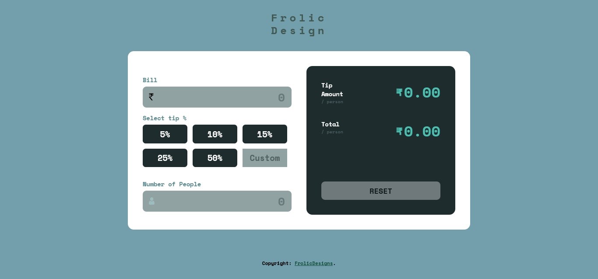

# Tip calculator App.

This is  my FrontEnd project made wih using HTML5, CSS3 and JavaScript.

## Overview

### Operations

Users should be able to:

- Calculate the correct tip and total cost of the bill per person.

### Screenshot

- Please find the screenshots attached. 

### Links

- Live Preview : [live site URL](https://tipcalculatorjsproject.netlify.app/)

## My process

### Built with

- Semantic HTML5 markup.
- CSS custom properties.
- Flexbox.

### Useful resources

- [Resource 1](https://htmlcolorcodes.com/) - For UI layout Color.
- [Resource 2](https://www.youtube.com/watch?v=yfoY53QXEnI) - Traversy Media & WebDevSimplified for UI styling and Layout design.

### Project Style Guide.

## Layout

The designs were created to the following widths:

- Mobile: 400px
- Desktop: 1440px

## Colors

### Primary

  --strong-cyan: hsl(172, 47%, 52%);

### Neutral
  --very-dark-cyan: hsl(188, 21%, 15%);
  --dark-grayish-cyan: hsl(187, 23%, 46%);
  --grayish-cyan: hsl(188, 14%, 32%);
  --light-grayish-cyan: hsla(192, 25%, 54%, 0.952);
  --very-light-grayish-cyan: hsl(180, 9%, 60%);
  --white: hsl(0, 0%, 100%);
  
## Typography

### Body Copy

- Font size (form inputs): 24px

### Font

- Family: [Space Mono](https://fonts.google.com/specimen/Space+Mono)
- Weights: 700

